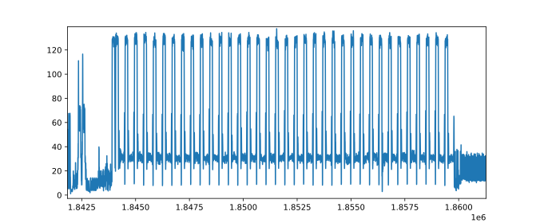
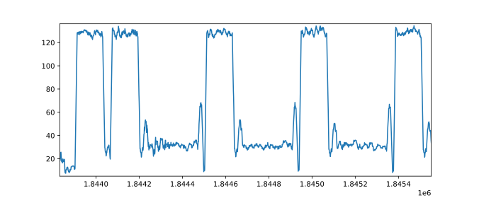

# Return of ECC dummy point addition: SPA on efficient P-256 implementation

The efficient implementation of the P-256 curve [1] rely on the introduction of dummy point additions to make the calculation constant-time.
In this repository, we provide a PoC that this implementation is vulnerable to Simple Power Analysis that reveals when the first point addition in a scalar multiplication is dummy (a particular case of SPA called Refined Power Analysis [2]).

This work has been presented at the [SSTIC 2021 conference](https://www.sstic.org/2021/presentation/return_of_ecc_dummy_point_additions_simple_power_analysis_on_efficient_p-256_implementation/) (presentation and paper are available on the link).

This project is licensed under the terms of the [GNU General Public License v3](https://www.gnu.org/licenses/gpl-3.0.en.html).

## Requirements

Running the experiment has several requirements:

* `TracerGrind` tool based on Valgrind ([SideChannelMarvels](https://github.com/SideChannelMarvels));
* `fpylll` the Python wrapper for `fplll` (https://pypi.org/project/fpylll/);
* `scikit-learn`, the machine learning tool of Python (https://scikit-learn.org/stable/).

## Build instructions

We provide a docker to make the installation easier.

1. Clone this repository
    ```bash
    git clone https://github.com/orangecertcc/security-research/simulations/ecdummyrpa.git
    ```
    
2. Then install our docker image:
    ```bash
    docker build -t ecdummyrpa .
    ```
            OR
2a. install our docker image with the original docker file:
    i. Delete the the file named "dockerfile" 
    ii. And rename the file named "dockerfile old" to "dockerfile"
    iii. Build our docker image with the samen command below
    ```bash
    docker build -t ecdummyrpa .
    ```
    
4. Now you can run the docker:
    ```bash
    docker run --privileged -it ecdummyrpa
    ```

## Running the PoC

### Key pair generation

The first step is to generate a pair of public/private ECDSA key on the P-256 curve:

```bash
openssl ecparam -genkey -name prime256v1 -out privkey.pem
openssl ec -in privkey.pem -pubout -out pubkey.pem
```

### Launch the simulation

Once everything is set, the simulation can be run with the Python script `simulation.py`.

```bash
python3 simulation.py -b <path_to_openssl> --privkey <private key> --working-dir <directory>  -n <number of signatures> --bounds <start> <end>
```

The argument `--bounds` is there to specify which part of the trace to keep to avoid storage of many unecessary parts of the trace. This is the only optional argument; by default, the whole trace is kept.
What can be done is run the command once with the option `-n 1` and look approximatively with `matplotlib.pyplot` the interesting part of the trace, and run again with the desired bounds.

For each signature, a message is signed with the private key and a power trace is simulated from the values read from memory during the calculations, thanks to the `TracerGrind` tool provided by SideChannelMarvels.

All signatures, messages and traces are stored in the working directory with the naming convention `message_1728.txt`, `signature_1728.bin`, and `trace_1728.txt` (numbering start from 0).

### Trace analysis and lattice attack

Finally, we can try and find the private key from the traces, signatures and the public key.
For that, run the command

```bash
python3 analysis.py --pubkey <public key> --working-dir <directory> -n <number of signatures> --bounds <start> <end>
```

The `bounds` argument is similar as in the simulation script, but here it is used to compare the traces in two classes: 

- First point addition is dummy;
- First point addition is **not** dummy

The attack should work best when the analysis is done on the part concerning the **first** point addition.

### Complete example

We run the simulation for one signature generation first:

```bash
python3 simulation.py -b /usr/local/bin/openssl --privkey privkey.pem --working-dir test -n 1
```

The directory `test` contains a trace called `trace_0.txt`. On each line is a measurement (modeled from the Hamming weight values read from memory, averaged with their surrounding values).

Let's take a look at the graph (with `matplotlib.pyplot` in Python).



This part of the trace is the scalar multiplication. Below we zoom at the beginning that corresponds to the first point additions.



The part that we are interested is the valley on the left between the positions approximatively `1844200` and `1844500`.

We run again the simulation, but this time 6000 times and with bounds.

```bash
python3 simulation.py -b /usr/local/bin/openssl --privkey privkey.pem --working-dir test -n 6000 --bounds 1844200 1844500
```

This is the longest part of the simulation, expect a few hours.

> To keep the trace for the whole scalar multiplication, we could have used `--bounds 1843850 1860000` instead. It would still be possible to run the analysis with a smaller part of the trace with the analysis tool later.

Once this is done, we run the analysis with the command:

```bash
python3 analysis.py --pubkey pubkey.pem --working-dir test -n 6000
```

> We have already traces reduced to the first point addition. Use the `--bounds` optional argument in case the traces cover more than this part of the calculation.

The results are obtained in a few seconds.

```
Loading 6000 traces...
Clustering of the traces...
Size of clusters: 5950, 50
Lattice attack: recovering of the key with 37 signatures...
Lattice attack: recovering of the key with 38 signatures...
SUCCESS!
The private key is deb867c4cf52002d7d8cc2e440d16c8c75c7844fdb142ea8c1a1f48b411b0251
```

The tool identified 50 traces out of the 6000 to be used in the lattice attack.
It failed with the first 37 signatures, but succeeded with the first 38.

> The file `sample.tar.gz` contains the traces, signatures, messages and the public key of this example.

This is all help option partaining to the docker file image below:
Usage:  docker run [OPTIONS] IMAGE [COMMAND] [ARG...]

Create and run a new container from an image

Aliases:
  docker container run, docker run

Options:
      --add-host list                  Add a custom host-to-IP mapping (host:ip)
      --annotation map                 Add an annotation to the container (passed through to the OCI runtime) (default map[])
  -a, --attach list                    Attach to STDIN, STDOUT or STDERR
      --blkio-weight uint16            Block IO (relative weight), between 10 and 1000, or 0 to disable (default 0)
      --blkio-weight-device list       Block IO weight (relative device weight) (default [])
      --cap-add list                   Add Linux capabilities
      --cap-drop list                  Drop Linux capabilities
      --cgroup-parent string           Optional parent cgroup for the container
      --cgroupns string                Cgroup namespace to use (host|private)
                                       'host':    Run the container in the Docker host's cgroup namespace
                                       'private': Run the container in its own private cgroup namespace
                                       '':        Use the cgroup namespace as configured by the
                                                  default-cgroupns-mode option on the daemon (default)
      --cidfile string                 Write the container ID to the file
      --cpu-count int                  CPU count (Windows only)
      --cpu-percent int                CPU percent (Windows only)
      --cpu-period int                 Limit CPU CFS (Completely Fair Scheduler) period
      --cpu-quota int                  Limit CPU CFS (Completely Fair Scheduler) quota
      --cpu-rt-period int              Limit CPU real-time period in microseconds
      --cpu-rt-runtime int             Limit CPU real-time runtime in microseconds
  -c, --cpu-shares int                 CPU shares (relative weight)
      --cpus decimal                   Number of CPUs
      --cpuset-cpus string             CPUs in which to allow execution (0-3, 0,1)
      --cpuset-mems string             MEMs in which to allow execution (0-3, 0,1)
  -d, --detach                         Run container in background and print container ID
      --detach-keys string             Override the key sequence for detaching a container
      --device list                    Add a host device to the container
      --device-cgroup-rule list        Add a rule to the cgroup allowed devices list
      --device-read-bps list           Limit read rate (bytes per second) from a device (default [])
      --device-read-iops list          Limit read rate (IO per second) from a device (default [])
      --device-write-bps list          Limit write rate (bytes per second) to a device (default [])
      --device-write-iops list         Limit write rate (IO per second) to a device (default [])
      --disable-content-trust          Skip image verification (default true)
      --dns list                       Set custom DNS servers
      --dns-option list                Set DNS options
      --dns-search list                Set custom DNS search domains
      --domainname string              Container NIS domain name
      --entrypoint string              Overwrite the default ENTRYPOINT of the image
  -e, --env list                       Set environment variables
      --env-file list                  Read in a file of environment variables
      --expose list                    Expose a port or a range of ports
      --gpus gpu-request               GPU devices to add to the container ('all' to pass all GPUs)
      --group-add list                 Add additional groups to join
      --health-cmd string              Command to run to check health
      --health-interval duration       Time between running the check (ms|s|m|h) (default 0s)
      --health-retries int             Consecutive failures needed to report unhealthy
      --health-start-period duration   Start period for the container to initialize before starting health-retries countdown
                                       (ms|s|m|h) (default 0s)
      --health-timeout duration        Maximum time to allow one check to run (ms|s|m|h) (default 0s)
      --help                           Print usage
  -h, --hostname string                Container host name
      --init                           Run an init inside the container that forwards signals and reaps processes
  -i, --interactive                    Keep STDIN open even if not attached
      --io-maxbandwidth bytes          Maximum IO bandwidth limit for the system drive (Windows only)
      --io-maxiops uint                Maximum IOps limit for the system drive (Windows only)
      --ip string                      IPv4 address (e.g., 172.30.100.104)
      --ip6 string                     IPv6 address (e.g., 2001:db8::33)
      --ipc string                     IPC mode to use
      --isolation string               Container isolation technology
      --kernel-memory bytes            Kernel memory limit
  -l, --label list                     Set meta data on a container
      --label-file list                Read in a line delimited file of labels
      --link list                      Add link to another container
      --link-local-ip list             Container IPv4/IPv6 link-local addresses
      --log-driver string              Logging driver for the container
      --log-opt list                   Log driver options
      --mac-address string             Container MAC address (e.g., 92:d0:c6:0a:29:33)
  -m, --memory bytes                   Memory limit
      --memory-reservation bytes       Memory soft limit
      --memory-swap bytes              Swap limit equal to memory plus swap: '-1' to enable unlimited swap
      --memory-swappiness int          Tune container memory swappiness (0 to 100) (default -1)
      --mount mount                    Attach a filesystem mount to the container
      --name string                    Assign a name to the container
      --network network                Connect a container to a network
      --network-alias list             Add network-scoped alias for the container
      --no-healthcheck                 Disable any container-specified HEALTHCHECK
      --oom-kill-disable               Disable OOM Killer
      --oom-score-adj int              Tune host's OOM preferences (-1000 to 1000)
      --pid string                     PID namespace to use
      --pids-limit int                 Tune container pids limit (set -1 for unlimited)
      --platform string                Set platform if server is multi-platform capable
      --privileged                     Give extended privileges to this container
  -p, --publish list                   Publish a container's port(s) to the host
  -P, --publish-all                    Publish all exposed ports to random ports
      --pull string                    Pull image before running ("always", "missing", "never") (default "missing")
  -q, --quiet                          Suppress the pull output
      --read-only                      Mount the container's root filesystem as read only
      --restart string                 Restart policy to apply when a container exits (default "no")
      --rm                             Automatically remove the container when it exits
      --runtime string                 Runtime to use for this container
      --security-opt list              Security Options
      --shm-size bytes                 Size of /dev/shm
      --sig-proxy                      Proxy received signals to the process (default true)
      --stop-signal string             Signal to stop the container
      --stop-timeout int               Timeout (in seconds) to stop a container
      --storage-opt list               Storage driver options for the container
      --sysctl map                     Sysctl options (default map[])
      --tmpfs list                     Mount a tmpfs directory
  -t, --tty                            Allocate a pseudo-TTY
      --ulimit ulimit                  Ulimit options (default [])
  -u, --user string                    Username or UID (format: <name|uid>[:<group|gid>])
      --userns string                  User namespace to use
      --uts string                     UTS namespace to use
  -v, --volume list                    Bind mount a volume
      --volume-driver string           Optional volume driver for the container
      --volumes-from list              Mount volumes from the specified container(s)
  -w, --workdir string                 Working directory inside the container


## References

[1] Shay Gueron and Vlad Krasnov. Fast prime field elliptic-curve cryptography with 256-bit primes, *J. Cryptogr. Eng.*, 2015, [DOI 10.1007/s13389-014-0090-x](https://doi.org/10.1007/s13389-014-0090-x)

[2] Louis Goubin. A Refined Power-Analysis Attack on Elliptic Curve Cryptosystems, *PKC*, 2003, [DOI 10.1007/3-540-36288-6_15](https://doi.org/10.1007/3-540-36288-6_15)

